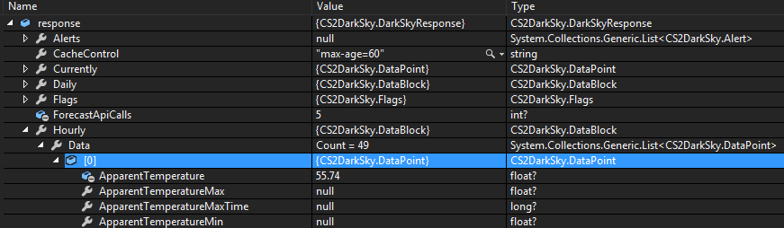

### CS2DarkSky ###
==================

C# Wrapper Library For [Dark Sky](https://darksky.net/)

------------------

###Usage###

```c#
    using CS2DarkSky;

    var service = new DarkSkyService("YOUR API KEY");
    var response = service.Download(37.8267, -122.423);
```

Returns the complete object :



####Get the observed (in the past) or forecasted (in the future) hour-by-hour and daily weather conditions for a particular date####

```c#
    using CS2DarkSky;

    var service = new DarkSkyService("YOUR API KEY");
    var response = service.Download(37.8267, -122.423, DateTime.Now, Unit.SI, Language.English);
```

####Extends the hourly period from 48 hours to 168 hours####

```c#
    using CS2DarkSky;

    var service = new DarkSkyService("YOUR API KEY");
    var response = service.Download(37.8267, -122.423, null, Units.SI, Language.English, extend: true);
```

####Exclude certain objects (returned as null)####

```c#
    using CS2DarkSky;

    var excludeBlocks = new [] { Exclude.alerts, Exclude.currently };
    var service = new DarkSkyService("YOUR API KEY");
    var response = service.Download(37.8267, -122.423, DateTime.Now, Unit.SI, Language.English, null, excludeBlocks);
```

####Please note:####

 - You will require your own Dark Sky [API Key](https://darksky.net/dev/)
 - Not all regions return forecasts by all periods (Daily, Minutely etc.)
 - Not all regions return all flags.

####Terms of service####

Please remember to follow the [Terms of Service of Dark Sky](https://darksky.net/dev/docs/terms) when it comes to use this library.

>You agree that any application or service which incorporates data obtained from the Service shall prominently display the message “Powered by Dark Sky” in a legible manner near the data or any information derived from any data from the Service. This message must, if possible, open a link to [https://darksky.net/poweredby/](https://darksky.net/poweredby/) when clicked or touched.
